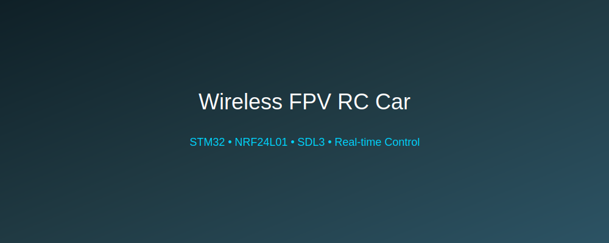
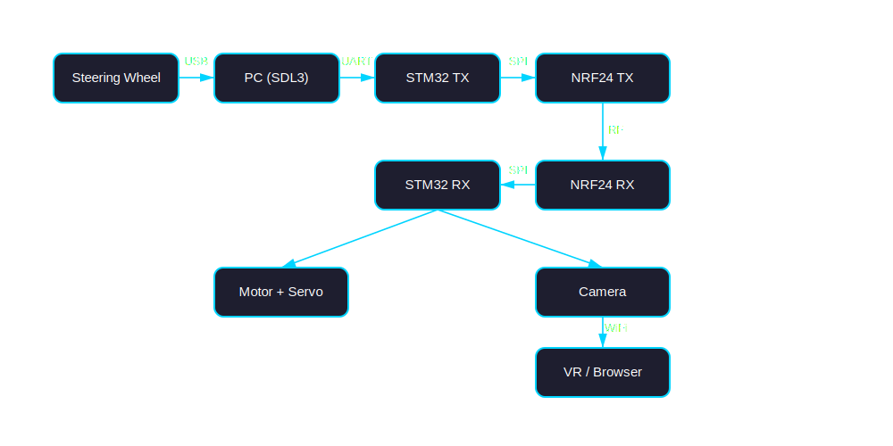

# 🚗📡 Wireless FPV RC Car System

<p align="center">
  
</p>

<p align="center">
  <b>Custom steering wheel → PC → STM32 → NRF24L01 → RC Car + FPV Camera</b><br>
  Low-latency wireless control system with real-time video streaming.
</p>

---

## ✨ Features

* 🎮 Steering wheel input via **SDL3 (C)**
* 🔌 USB Serial communication (PC → STM32)
* 📡 NRF24L01 wireless transmission
* ⚡ Low-latency control system
* 🚗 Custom-modified RC car (motor + servo)
* 📷 Live camera streaming over web
* 🥽 VR-ready viewing capability (future extension)

---

## 🧠 System Architecture

<p align="center">
  
</p>

### 🔄 Data Flow

```text
Steering Wheel
      ↓ (USB)
      PC (SDL3 App)
      ↓ (Serial UART)
   STM32 #1 (Transmitter)
      ↓ (NRF24L01 RF)
   STM32 #2 (Receiver)
      ↓
  Motor + Servo Control
      ↓
   Camera Module → Web Stream
```

---

## 🧩 Hardware Components

### 🖥️ Transmitter Side

* PC (Windows)
* Steering Wheel Controller
* STM32
* NRF24L01 Module

### 🚙 Receiver Side

* STM32
* NRF24L01 Module
* DC Motor Driver (e.g., L298N / BTS7960)
* Servo Motor
* Camera Module

---

## 🔌 Wiring & Schematics

<p align="center">
  
  
</p>
---

## 💻 Software Overview

### 🖥️ PC Application

* Language: **C**
* Library: **SDL3**
* Responsibilities:

  * Read steering wheel input
  * Normalize control signals
  * Send via serial

---

### 🔁 STM32 Transmitter

* Receives serial data
* Packs into RF payload
* Sends via NRF24L01

---

### 📡 STM32 Receiver

* Receives RF packets
* Decodes control signals
* Drives:

  * Motor (PWM)
  * Servo (PWM)

---
## 🛠️ Build & Setup

### PC Side

```bash
git clone https://github.com/PabloVro006/VR_RcCar
cd pc-controller
./run.bat
```

---

### STM32

Use:

* STM32CubeIDE

Flash both boards:

* `stm32_tx/` → Transmitter
* `stm32_rx/` → Receiver

---

## 📷 Demo

<p align="center">
  
</p>

---

## ⚠️ Notes

* NRF24L01 requires stable **3.3V** (use a capacitor!)
* Keep antenna orientation consistent
* Minimize RF interference

---

## 📁 Project Structure

```bash
.
├── pc-controller/      # SDL3 application
├── stm32_tx/           # Transmitter firmware
├── stm32_rx/           # Receiver firmware
├── docs/
│   ├── images/
│   └── schematics/
└── README.md
```

---

## 🤝 Contributing

Pull requests are welcome! For major changes, open an issue first.
